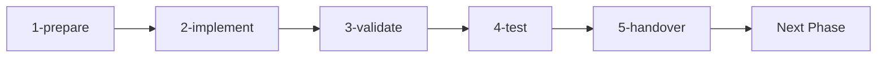

# Claude JS Quality Hooks - Development Tools

This directory contains specialized agents and slash commands for implementing the claude-jsqualityhooks project using a structured, phase-based approach.

## Architecture Overview

The tools follow a **separation of concerns** model:
- **Slash Commands** - Orchestrate workflow and user interaction
- **Agents** - Execute specialized tasks with deep expertise
- **Clear Boundaries** - No duplication between tools

## Agents (.claude/agents/)

### 1. knowledge-navigator
**Purpose**: Documentation expert that searches and references docs/ and plan/ folders  
**Tools**: Read, Glob, Grep, LS  
**Use**: Finding information, providing references with line numbers

### 2. phase-orchestrator
**Purpose**: Manages phase transitions, dependencies, and handovers  
**Tools**: Read, Write, TodoWrite, Bash  
**Use**: Phase state management, creating handover documents, enforcing boundaries

### 3. typescript-implementer
**Purpose**: TypeScript/Node.js coding expert for all implementation  
**Tools**: Read, Write, Edit, MultiEdit, Bash, TodoWrite  
**Use**: Writing production code, following patterns, using correct libraries

### 4. quality-guardian
**Purpose**: Reviews code against success criteria and requirements  
**Tools**: Read, Grep, Glob, Bash  
**Use**: Validation, scope management, quality assurance

### 5. test-engineer
**Purpose**: Testing specialist for unit, integration, and performance tests  
**Tools**: Read, Write, Edit, Bash, TodoWrite  
**Use**: Creating tests, running validation, ensuring coverage

## Slash Commands (.claude/commands/phases/)

### Phase Development Commands

All commands accept a phase folder argument (e.g., `phase-1-infrastructure`):

#### `/phases:1-prepare [phase-folder]`
- Reviews plan and documentation
- Validates prerequisites
- Creates feature branch
- Requests user approval

#### `/phases:2-implement [phase-folder]`
- Executes phase implementation
- Uses typescript-implementer agent
- Tracks progress with TODOs
- Follows plan tasks exactly

#### `/phases:3-validate [phase-folder]`
- Checks success criteria
- Reviews code quality
- Ensures no scope creep
- Generates validation report

#### `/phases:4-test [phase-folder]`
- Runs appropriate tests
- Documents deferred tests
- Creates test placeholders
- Provides manual test instructions

#### `/phases:5-handover [phase-folder]`
- Completes current phase
- Creates handover document
- Commits changes
- Prepares for next phase

## Workflow

### Standard Phase Implementation Flow



### Example Usage

```bash
# Phase 1: Infrastructure
/phases:1-prepare phase-1-infrastructure
# Review plan, get approval
/phases:2-implement phase-1-infrastructure
# Code implementation
/phases:3-validate phase-1-infrastructure
# Quality checks
/phases:4-test phase-1-infrastructure
# Testing (may be limited)
/phases:5-handover phase-1-infrastructure
# Complete and document

# Phase 2: Validators
/phases:1-prepare phase-2-validators
# ... continue flow
```

## Key Principles

### 1. Phase Boundaries
- Work stays within current phase
- Future phase work is deferred
- Past phase changes need approval
- Dependencies tracked strictly

### 2. Documentation References
- All work references plan/ folder
- Documentation cited with line numbers
- No code copying, only pattern implementation
- Knowledge navigator finds information

### 3. Stack Specifics
```json
{
  "packageManager": "pnpm@10.14.0",
  "key-libraries": {
    "commander": "14.0.0",
    "yaml": "2.8.1",
    "zod": "4.0.15",
    "execa": "9.6.0",
    "fast-glob": "3.3.3"
  },
  "build": "tsup",
  "test": "vitest",
  "quality": "@biomejs/biome"
}
```

### 4. Quality Standards
- TypeScript strict mode always
- >80% test coverage goal
- Performance <100ms per file
- Error handling non-blocking
- Biome 1.x and 2.x support

## Agent Collaboration

### How Agents Work Together

1. **Knowledge Flow**
   - knowledge-navigator provides references
   - Other agents consume information
   - No direct agent-to-agent calls

2. **Phase Management**
   - phase-orchestrator controls state
   - typescript-implementer executes
   - quality-guardian validates
   - test-engineer verifies

3. **Quality Loop**
   - Implementation → Validation → Testing
   - Issues found → Back to implementation
   - All criteria met → Handover

## Handover Documents

Located in `plan/handovers/`, these documents:
- Summarize completed work
- List deferred items
- Document known issues
- Prepare next phase
- Track integration points

## Important Notes

### For Users
1. Always start with `/phases:prepare`
2. Don't skip validation or testing
3. Review handover documents
4. Approve phase transitions

### For Agents
1. Stay within assigned expertise
2. Reference documentation precisely
3. Track all work in TODOs
4. Defer out-of-scope items

### For Commands
1. Orchestrate, don't implement
2. Use appropriate agents
3. Maintain phase boundaries
4. Request user decisions

## Project Structure Impact

These tools create and modify:
```
src/                 # Production code
tests/               # Test files
plan/handovers/      # Phase transition docs
.debug/              # Debug output (dev only)
```

## Success Metrics

Each phase completion requires:
- ✅ All task TODOs complete
- ✅ Success criteria met
- ✅ Validation passing
- ✅ Tests documented
- ✅ Handover created

## Troubleshooting

### Common Issues

1. **Prerequisites not met**
   - Check plan/review/DEPENDENCIES.md
   - Verify previous phase complete

2. **Validation failures**
   - Review with quality-guardian
   - Check against success criteria
   - Fix and re-validate

3. **Test dependencies**
   - Document in handover
   - Create placeholders
   - Note for Phase 5

4. **Scope creep**
   - Defer to future phase
   - Document in handover
   - Stay focused

## Next Steps

To begin implementation:
1. Review plan/PLAN-OVERVIEW.md
2. Start with Phase 1: `/phases:1-prepare phase-1-infrastructure`
3. Follow the numbered workflow (1-prepare → 2-implement → 3-validate → 4-test → 5-handover)
4. Complete all 5 phases sequentially

## Support

For issues or questions:
- Check plan/ documentation
- Review docs/ folder
- Use knowledge-navigator agent
- Consult phase-specific guides