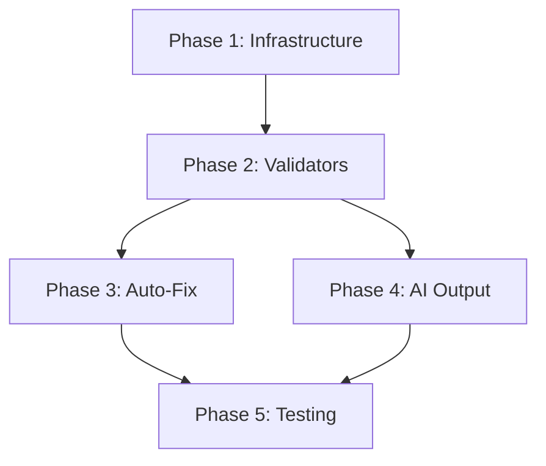

# Development Guide

## Implementation Phases

The project is divided into 5 sequential implementation phases, each building on the previous one.

### Phase Overview

1. **Core Infrastructure** - Hook system and basic architecture
2. **Validation Integration** - Biome and TypeScript validators
3. **Auto-Fix Implementation** - Automatic issue resolution
4. **AI Output Formatting** - Claude-optimized responses
5. **Testing & Optimization** - Quality assurance and performance

## Development Workflow

### Prerequisites

1. Set up development environment:
   ```bash
   git clone <repository>
   cd claude-hooks-format-lint
   npm install
   ```

2. Install validation tools:
   ```bash
   npm install --save-dev @biomejs/biome@^2
   npx @biomejs/biome init
   ```

3. Configure TypeScript:
   ```bash
   npx tsc --init
   # Configure tsconfig.json for strict mode
   ```

### Development Process

1. **Feature Branch Strategy**
   ```bash
   git checkout -b feature/phase-X-description
   ```

2. **Implementation Order**
   - Follow phase guides in `docs/implementation/`
   - Complete unit tests before moving to next component
   - Integration test after each phase

3. **Code Standards**
   - Use Biome for formatting/linting
   - Follow TypeScript strict mode
   - Document all public APIs
   - Maintain >80% test coverage

### Build Process

```bash
# Development build
npm run build:dev

# Production build
npm run build

# Watch mode
npm run dev
```

### Testing Strategy

```bash
# Unit tests
npm run test:unit

# Integration tests
npm run test:integration

# Full test suite
npm test

# Coverage report
npm run test:coverage
```

## Phase Dependencies



## Component Development Order

### Phase 1: Core Infrastructure
1. `src/config/yamlConfigLoader.ts`
2. `src/hooks/hookManager.ts`
3. `src/types/index.ts`
4. `src/hooks/postWrite.ts`

### Phase 2: Validators
1. `src/validators/biome/versionDetector.ts`
2. `src/validators/biome/v1Adapter.ts`
3. `src/validators/biome/v2Adapter.ts`
4. `src/validators/biome/index.ts`
5. `src/validators/typescript.ts`

### Phase 3: Auto-Fix
1. `src/fixers/autoFix.ts`
2. `src/fixers/conflictResolver.ts`

### Phase 4: AI Output
1. `src/formatters/biomeJsonParser.ts`
2. `src/formatters/typescriptFormatter.ts`
3. `src/formatters/aiOutputFormatter.ts`
4. `src/notifications/claudeNotifier.ts`

### Phase 5: Testing
1. Unit tests for each component
2. Integration tests for workflows
3. Performance benchmarks
4. Error scenario testing

## Key Implementation Decisions

### Why YAML Configuration?
- Human-readable and editable
- Comments support for documentation
- Simpler than JSON for complex configs
- Standard in DevOps tooling

### Why Support Both Biome Versions?
- v1.x is stable and widely adopted
- v2.x offers performance improvements
- Auto-detection prevents breaking changes
- Smooth migration path for users

### Why Post-Write Hooks Only?
- Complete file context for validation
- Avoid validating partial/invalid code
- Simpler error handling
- Better performance

### Why AI-Optimized Output?
- Claude needs clear, structured feedback
- Terminal formatting confuses AI parsing
- Consistent format improves reliability
- Enables better error resolution

## Common Patterns

### Error Handling Pattern
```typescript
try {
  const result = await validator.validate(file);
  return formatSuccess(result);
} catch (error) {
  logger.error('Validation failed', error);
  return formatError(error, { fallback: true });
}
```

### Version Detection Pattern
```typescript
const version = await detectVersion() || 
                await fallbackDetection() || 
                DEFAULT_VERSION;
```

### Parallel Processing Pattern
```typescript
const results = await Promise.allSettled(
  files.map(file => validateFile(file))
);
```

## Debugging Tips

1. **Enable Verbose Logging**
   ```yaml
   notifications:
     verbose: true
   ```

2. **Test Individual Validators**
   ```bash
   npm run test:validator -- biome
   ```

3. **Check Version Detection**
   ```bash
   npm run debug:version
   ```

4. **Inspect AI Output**
   ```bash
   npm run debug:format -- sample.json
   ```

## Contributing Guidelines

1. **Code Style**
   - Run Biome before committing
   - Follow existing patterns
   - Add JSDoc comments

2. **Testing**
   - Write tests first (TDD)
   - Test edge cases
   - Mock external dependencies

3. **Documentation**
   - Update relevant docs
   - Add examples for new features
   - Document breaking changes

4. **Pull Requests**
   - One feature per PR
   - Include tests
   - Update documentation
   - Pass CI checks

## Release Process

1. Update version in `package.json`
2. Update CHANGELOG.md
3. Run full test suite
4. Build production bundle
5. Tag release in git
6. Publish to npm (if applicable)