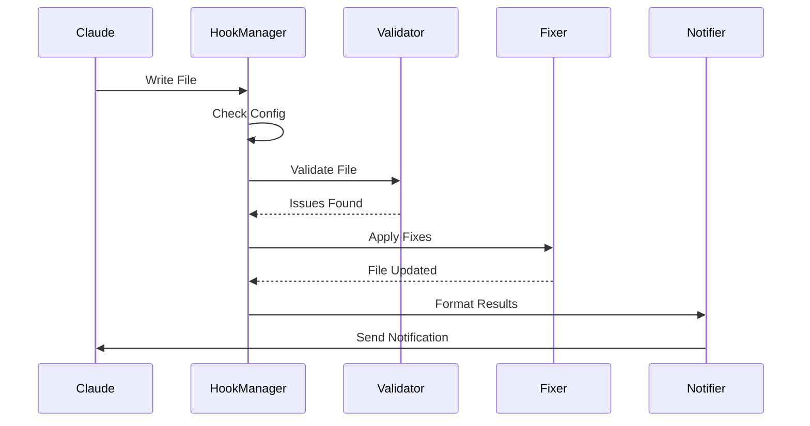

# Hook System

## Overview

The hook system intercepts file operations from Claude Code and triggers validation and fixing workflows. The system is designed to be non-blocking and transparent to the user while ensuring code quality.

## Hook Types

### 1. Post-Write Hook

**Purpose**: Primary validation and fixing mechanism that runs after Claude writes or modifies files.

**Trigger Events**:
- File creation
- File modification
- Batch file operations

**Workflow**:
```typescript
// Simplified workflow
async function onPostWrite(file: FileInfo): Promise<void> {
  // 1. Check if file should be validated
  if (!shouldValidate(file)) return;
  
  // 2. Run validators in parallel
  const results = await runValidators(file);
  
  // 3. Apply auto-fixes if enabled
  if (config.autoFix && results.hasFixableIssues) {
    const fixed = await applyFixes(file, results);
    await writeFile(file.path, fixed.content);
  }
  
  // 4. Notify Claude about changes
  await notifyClaude(results);
}
```

**Key Features**:
- Validates complete file content
- Applies automatic fixes
- Updates file if modified
- Notifies Claude of changes
- Non-blocking execution

### 2. Pre-Read Hook (Optional)

**Purpose**: Ensures Claude reads clean, properly formatted code.

**Trigger Events**:
- Before file read operations
- Before file content is sent to Claude

**Use Cases**:
- Clean up files before Claude processes them
- Ensure consistent formatting in Claude's context
- Fix known issues proactively

**Configuration**:
```yaml
hooks:
  preRead:
    enabled: false  # Disabled by default
    timeout: 2000
    failureStrategy: ignore
    autoFix: false
```

### 3. Batch Operation Hook

**Purpose**: Efficiently handle multiple file operations.

**Trigger Events**:
- Multiple files modified simultaneously
- Bulk operations from Claude
- Project-wide refactoring

**Optimization**:
- Process files in parallel
- Share validation context
- Aggregate results
- Single notification to Claude

## Hook Lifecycle



## Configuration

### Hook-Specific Settings

```yaml
hooks:
  postWrite:
    enabled: true
    timeout: 5000
    failureStrategy: warn  # block | warn | ignore
    autoFix: true
    reportToUser: true
    runValidators:
      - biome
      - typescript
```

### Failure Strategies

- **block**: Prevent operation if validation fails
- **warn**: Continue but report issues
- **ignore**: Continue silently

## Error Handling

### Timeout Handling
```typescript
const result = await Promise.race([
  runValidator(file),
  timeout(config.timeout)
]);
```

### Graceful Degradation
- Continue with remaining validators if one fails
- Report partial results
- Log errors for debugging
- Never block Claude's operations

## Performance Optimizations

### Debouncing
Prevent multiple validations for rapid changes:
```typescript
const debouncedValidate = debounce(
  validate,
  config.performance.debounceDelay
);
```

### Caching
Cache validation results for unchanged files:
```typescript
if (cache.has(fileHash) && !cache.isExpired(fileHash)) {
  return cache.get(fileHash);
}
```

### Parallel Processing
Run independent operations concurrently:
```typescript
const results = await Promise.allSettled([
  validateWithBiome(file),
  validateWithTypeScript(file)
]);
```

## Integration Points

### Claude Code API
- Register hooks on initialization
- Listen for file operation events
- Send notifications back to Claude

### File System
- Read file content for validation
- Write fixed content back
- Watch for external changes

### Validators
- Pass file content to validators
- Receive structured results
- Handle validator-specific configs

## Testing Hooks

### Unit Tests
```typescript
describe('PostWriteHook', () => {
  it('should validate file after write', async () => {
    const file = mockFile('test.ts');
    const result = await postWriteHook(file);
    expect(result.validated).toBe(true);
  });
});
```

### Integration Tests
- Test with real Claude Code API
- Verify file system operations
- Check notification delivery
- Measure performance impact

## Best Practices

1. **Non-Blocking**: Never block Claude's operations
2. **Transparent**: Clear notifications about changes
3. **Efficient**: Minimize performance impact
4. **Reliable**: Handle errors gracefully
5. **Configurable**: Allow users to customize behavior